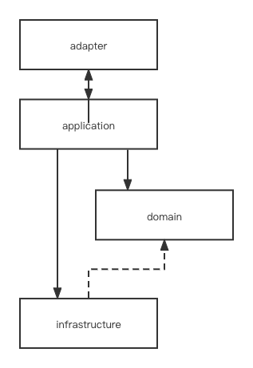

# ddd-framework

<p align="center">
  <a href="https://github.com/ken-xue/ddd-framework/blob/master/LICENSE">
    
  </a>
  <a href="https://www.oracle.com/java">
    
  </a>
</p>
<p align="center">
<a title="GitHub Watchers" target="_blank" href="https://github.com/ken-xue/ddd-framework/watchers"></a>  
  <a title="GitHub Stars" target="_blank" href="https://github.com/ken-xue/ddd-framework/stargazers"></a>  
  <a title="GitHub Forks" target="_blank" href="https://github.com/ken-xue/ddd-framework/network/members"></a>
</p>

<p align="center"><a title="Chinese" href="README.md"> 中文简体</a>  |  English</p>


## Introduction

> ddd-framework It is a development scaffold based on Domain Driven Design. It has high expansibility and can deal with the architecture of large and complex systems. Adopt [front](https://github.com/ken-xue/ddd-framework-vue) and [back-end](https://github.com/ken-xue/ddd-framework) separate development and provide [code generator](https://github.com/ken-xue/ddd-framework-maven-plugin)

## Architecture

### Application Layer



### Directory Structure

```
ddd-framework
    ├─core              核心模块
    │  ├─acl                防腐层
    │  ├─adapter            控制层
    │  ├─application        应用层
    │  ├─core-client        核心二方包
    │  ├─domain             领域层
    │  ├─share-dataobject   全局共享数据对象
    │  └─infrastructure     基础设施层
    ├─extensions        外部拓展
    │  └─acl-impl           acl实现
    ├─client                二方包
    ├─core                  启动类
    ├─dependencies          依赖管理
    └─doc                   文档数据
```

## QuickStart

```bash
git clone https://github.com/ken-xue/ddd-framework.git
cd ddd-framework
mvn install
```

- If you encounter mapstruct problems, please set the following settings in idea

Setting->Build,Execution,Deployment->Compiler->User-local build
```shell
-Djps.track.ap.dependencies=false
```

## CodeGenerator

1.create you database table

2.import maven dependency

```xml
<plugin>
    <groupId>io.ddd.framework</groupId>
    <artifactId>ddd-framework-maven-plugin</artifactId>
    <version>1.0.2-SNAPSHOT</version>
    <configuration>
        <dataSource>
            <driverName>com.mysql.cj.jdbc.Driver</driverName>
            <url>jdbc:mysql://127.0.0.1:3306/ddd_framework</url>
            <username>root</username>
            <password>123456</password>
        </dataSource>
        <config>
            <sourcePath>./</sourcePath>
            <tablePrefixes>sys_,biz_</tablePrefixes>
            <moduleName>sys</moduleName>
            <packageName>io.ddd.framework</packageName>
            <tableNames>sys_user,sys_menu</tableNames>
            <excludeFields>id,uuid,creator,modifier,gmt_create,gmt_modified,deleted</excludeFields>
            <author>麦奇</author>
            <email>biaogejiushibiao@outlook.com</email>
        </config>
    </configuration>
</plugin>
```

3.execute cmd

```shell
mvn ddd-framework:generate
```
4.clean last time code

```shell
mvn ddd-framework:delete
```

5.perfect ! success generate code in you project path ! enjoy ! maven plugin source code see

## Document

- [design document]()

## License

MIT see [LICENSE](./LICENSE).

welcome!
